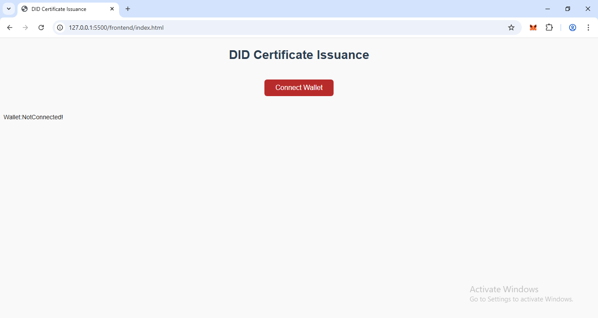
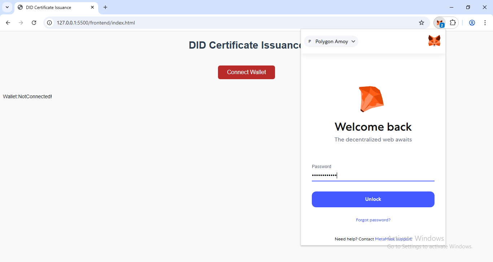
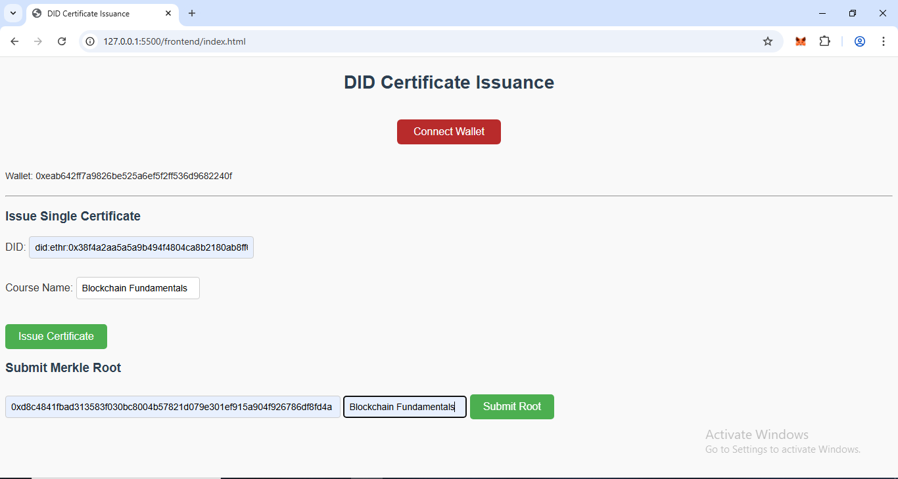
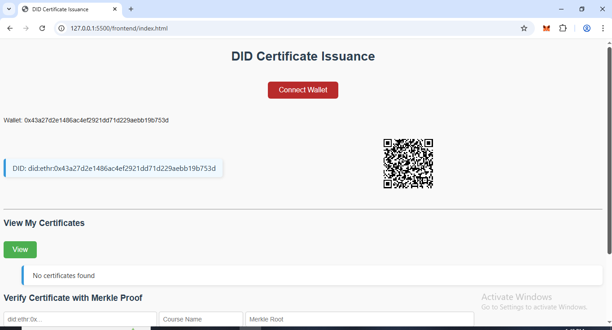
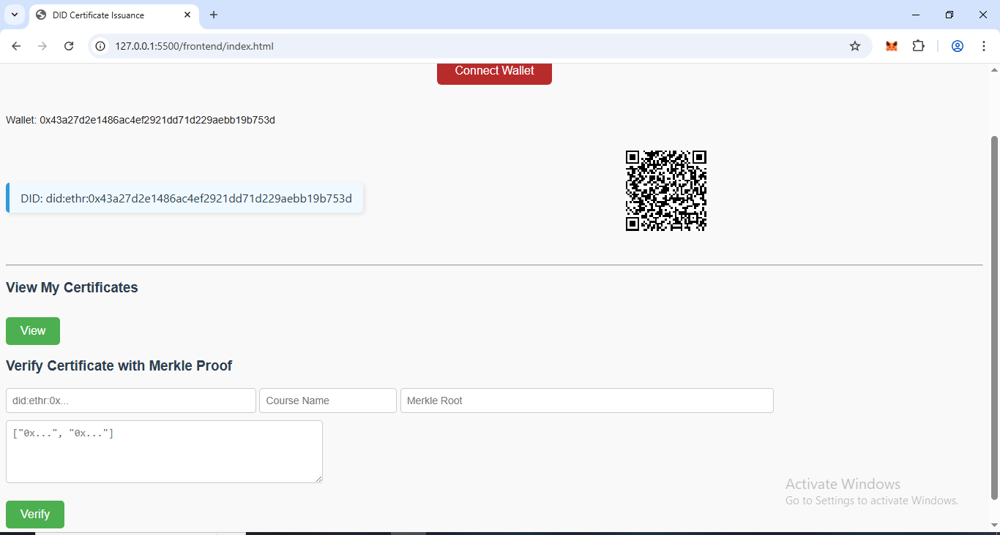

# DID-Based Certificate Issuance with Merkle Root Batch Verification on Polygon

A decentralized certificate issuance DApp that allows issuers to issue certificates individually or in batches using Merkle roots, and lets recipients verify them using their DID and Merkle proof. Built on the Polygon Amoy Testnet.

---

## Live Links

- **Deployed Smart Contract:** [Polygon Amoy](https://amoy.polygonscan.com/address/0xa37d6e5ee869292A0e66F408531Bd65Be8Db9bA7)

---

## Features

### Issuer Features

- Issue a single certificate using a DID and course name
- Upload a CSV of certificates to generate a Merkle Tree
- Submit Merkle root to blockchain for batch issuance

### Recipient Features

- Connect wallet to Generate DID
- View individually issued certificates
- Verify a batch certificate using:
  - Leaf hash (`keccak256(did + course)`)
  - Merkle proof
  - Merkle root

---

## 📂 Project Structure

```bash
did-cert-assignment/
├── contracts/
│ └── DIDCertificate.sol # Smart contract
├── frontend/
│ ├── index.html # DApp frontend
│ └── app.js # JS logic with Ethers.js
│ └── styles.css # CSS style
├── ignition/modules/
│ └── DIDCertificateModule.js # Hardhat deploy script
├── sripts/
│ └── merkle_generate.js # Merkle Tree generation
├── data/
│ └── sample_batch.csv # Sample CSV for batch issuance
│ └── proofs.json # MerkelRoot and Proof Record
├── .env # Amoy RPC + private key (not committed)
├── hardhat.config.js # Network config
└── README.md
```

---

## Tech Stack

Blockchain - Polygon Amoy Testnet  
 Smart Contract - Solidity + Hardhat  
 Web3 Layer - Ethers.js  
 Frontend - HTML/CSS/JavaScript  
 Wallet - MetaMask  
 Hashing - keccak256  
 Merkle Tree - merkletreejs

---

## Setup Instructions

### 1. Clone and Install

```bash
git clone https://github.com/akshayblockchain/DIDCertification.git
cd did-cert-assignment
npm install

```

### 2. Setup Environment Variables and add network to harhat.config.js

```bash
Create a .env file:
PRIVATE_KEY=your_wallet_private_key
POLYGON_AMOY_RPC=https://rpc-amoy.polygon.technology

networks:{
    polygon_amoy:{
      url: process.env.POLYGON_AMOY_RPC,
      accounts: [process.env.PRIVATE_KEY],
      chainId:80002,
    },
}
```

### 3. Compile and Deploy Contract

```bash
npx hardhat compile
npx hardhat ignition deploy ignition/modules/DIDCertificateModule.js --network polygon_amoy
```

### 4. Run Merkle Tree Script

Edit data/sample_batch.csv, then run:

```bash
node scripts/merkle_generate.js
```

The MerkelRoot and Proof are store as proof.json on same folder

```bash
did,courseName
did:ethr:0x1234567890abcdef1234567890abcdef12345678,Blockchain Fundamentals
did:ethr:0xabcdefabcdefabcdefabcdefabcdefabcdefabcd,Blockchain Fundamentals
did:ethr:0x9abcdef01234567890abcdefabcdef1234567890,Blockchain Fundamentals
```

## Issuer Login

    -Connect wallet (MetaMask)
    -Check at backend wheather Issuer or Receipient
    -Display according to issuer.

    Single Issuance:
        -Enter recipient DID, course name
        -Click “Issue”
        -Blockchain stores the certificate

    Batch Issuance:
        -Upload CSV/JSON: list of DIDs + courses
            Off-chain:
                -Hash each record (e.g., keccak256(did + course))
                -Build a Merkle tree
                -Get Merkle root
                -Submit Merkle root to contract
                -Generate Merkle proof for each recipient and create the record json file.

## Recipient Flow

    -Connect wallet
    -System derives DID (did:ethr:<wallet_address>)
    -View individually issued certificates

    For batch issued certificates:
        -Paste their did + Batch Name + proof
        -App hashes it and verifies Merkle proof on-chain
        -Show status: “Valid Certificate” or “Invalid Proof”

## Learning

    -Learned how Decentralized Identifiers (DIDs) work (did:ethr:<wallet>)
    -Used Merkle Trees for batch data verification on-chain
    -Built a Web3 DApp with Ethers.js
    -Deployed Solidity contracts on Polygon Amoy Testnet

## Screenshots







